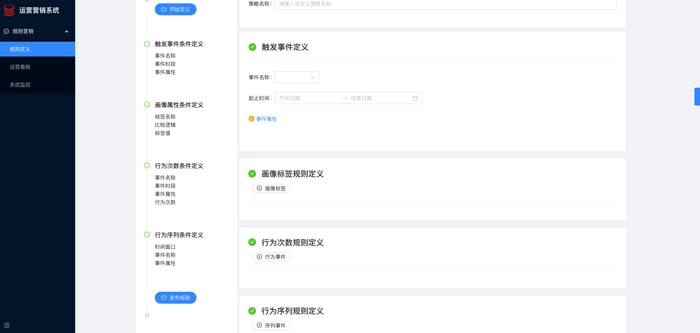

# marking-forntend

营销引擎前端-运营系统 采用ant-designpro开发

### 添加额外依赖库

```bash
yarn add axios
yarn add nanoid
```

### 安装 `node_modules`:

```bash
npm install
```

or

```bash
yarn
```

## 前端模块编译启动脚本

命令的配置写在文件`package.json`中. 可以根据需求在该文件中添加自定义命令脚本:

### 启动项目

```bash
npm start
```

or

```bash
yarn start
```

### 编译项目

```bash
npm run build
```

### 展示效果

指标检测


指标定义



